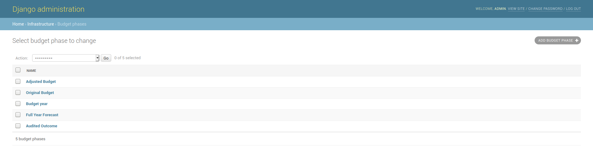
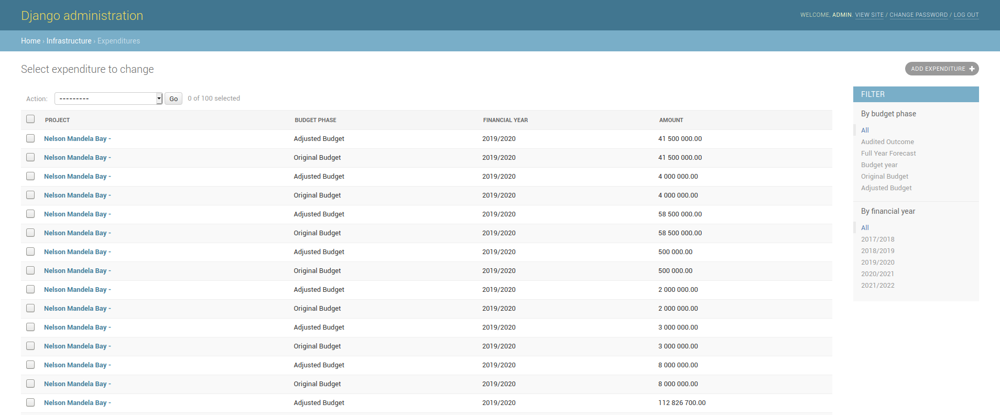
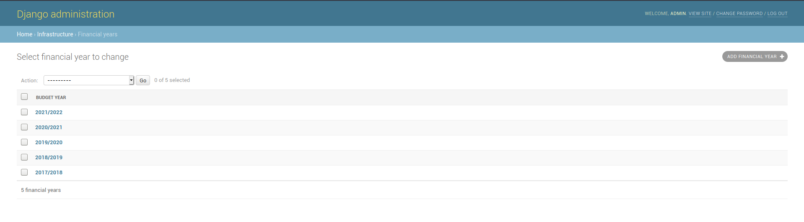
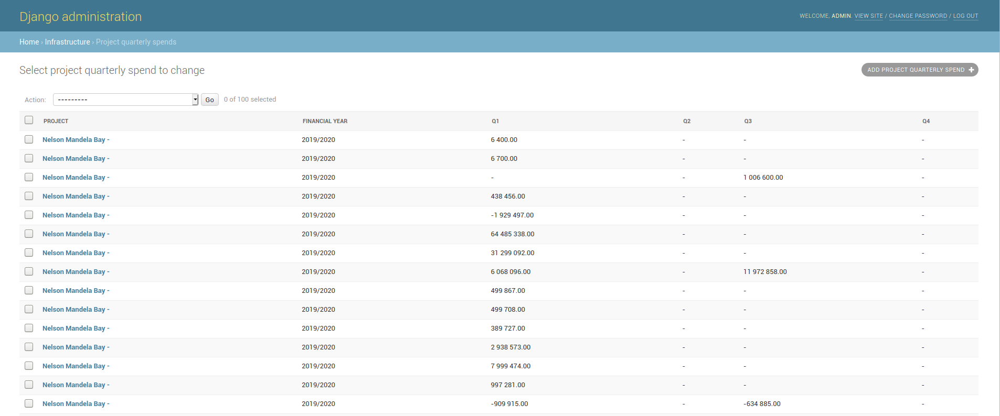
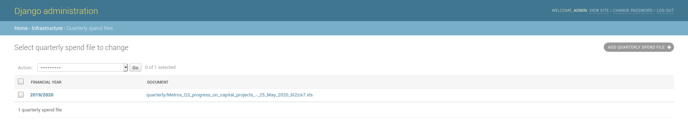

# Capital Projects

* [Budget phases](http://localhost:8000/admin/infrastructure/budgetphase/)
* [Expenditures](http://localhost:8000/admin/infrastructure/expenditure/)
* [Financial years](http://localhost:8000/admin/infrastructure/financialyear/)
* [Project quarterly spends](http://localhost:8000/admin/infrastructure/projectquarterlyspend/)
* [Projects](http://localhost:8000/admin/infrastructure/project/)
* [Quarterly spend files](http://localhost:8000/admin/infrastructure/quarterlyspendfile/)

## Budget Phases

This section contains the various phases a budget has.

### Adding a new Budget Phase

1.  Click on ADD BUDGET PHASE+ button.
2. Enter a budget phase, it has to be unique.
3. Click on save.

## Expenditures

This section contains the budgets phase expenditures for the capital projects.

### Adding a new expenditure

Expenditures should not be added manually. See [Quarterly Spend Files](capital-projects.md#quarterly-spend-files)

## Financial Years

Financial years are setup in this section. 

### Adding a new financial year

1. Click on ADD FINANCIAL YEAR+
2. Add a new financial year, make sure the format matches the other financial years.
3. Click on save.

## Project Quarterly Spends

This section contains the performance results for the metros

### Adding a new Quarterly Result

See [Quarterly Spend Files](capital-projects.md#quarterly-spend-files) for how to update the data

## Projects

This section show a list of all the capital projects.

### Adding  new project

Projects show generally not be added manually, see [Quarterly Spend Files](capital-projects.md#quarterly-spend-files)

## Quarterly Spend Files

This section show how to upload new quarterly data for capital projects

### Adding a new Quarterly spend file

Every quarter, national treasury will provide a file which will contain the expenditures and totals of the projects and in some case add new projects to the list. The file will look as follows.



1. Click on ADD QUARTERLY SPEND FILE+
2. Select a financial year and add the file that is provided from treasury.
3. Click on save.

The file will be processed in the background and will begin to populate the following sections

* Project
* Expenditure
* Project Quarterly Spends.

