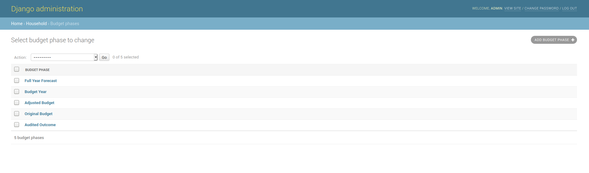
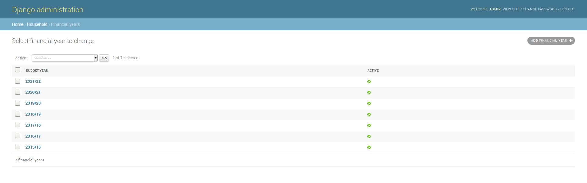
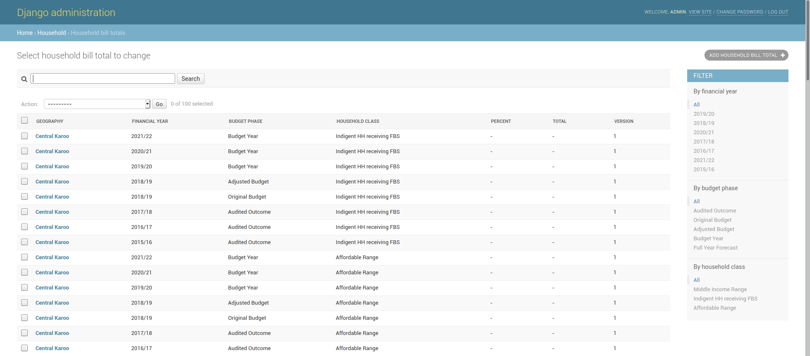
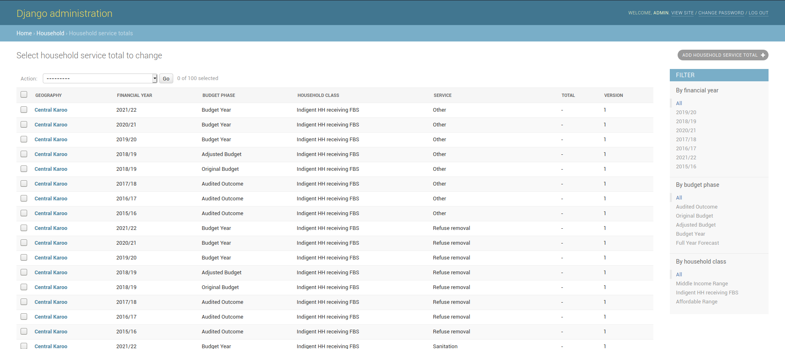
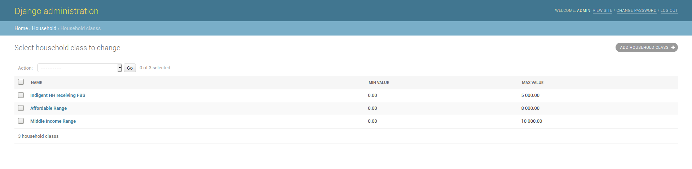
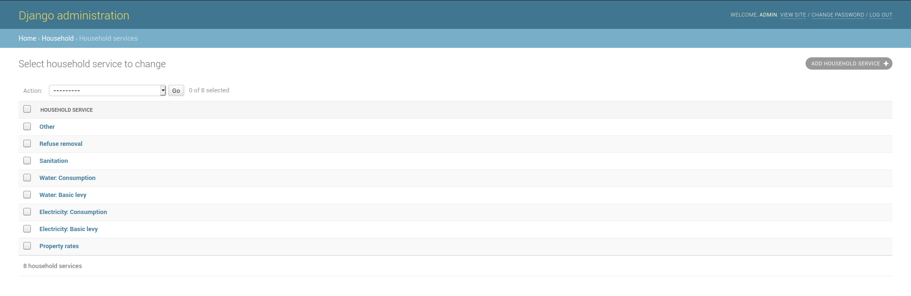

# Household Bills

* Budget Phases
* Data set files
* Financial Years
* Household bill totals
* Household classes
* Household service totals
* Household Services

## Budget Phases

This section contains the various budget phases

### Adding a new budget phase

1. Click on ADD BUDGET PHASE+
2. Add a budget phase, it has to be a unique name.
3. Click on save.

## Data Set Files

## Financial Years

### Adding a new financial year

1. Click on ADD FINANCIAL YEAR+
2. Add a new year
   * make sure the year matches the format of the previous financial years.
   * mark the financial year as active if results for that year should be shown.
3. Click on save.

## Household Bill Totals

## Household Service Totals

## Household Classes

### Adding a new household Class

1. Click on ADD HOUSEHOLD CLASS+
2. Add a new class.

   * The min and max value determine the threshold for each household class. If the data has values outside this range, it typically means that there are errors in the data. This values ouside the bounds will not be show. These values have been determined by national treasury

3. Click on save.

## Household Services

### Adding a new household service

1. Click on ADD HOUSEHOLD SERVICE+
2. Add a service, the name must be unique.
3. Click on save.

