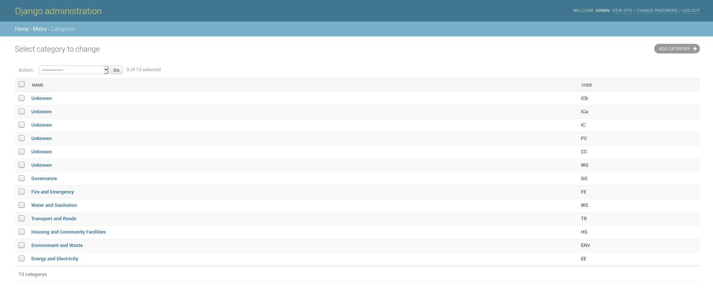
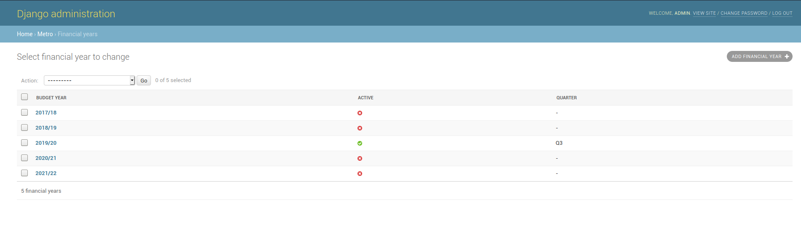
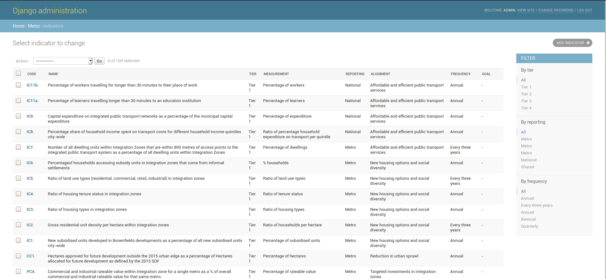
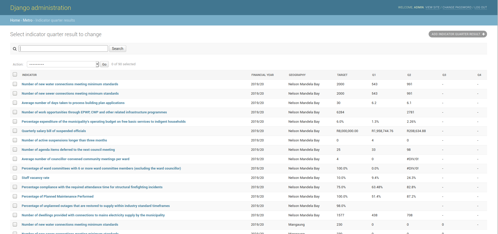

# Metro Focus

* [Category](metro-focus.md#category)
* [Financial Year](metro-focus.md#financial-year)
* [Indicators](metro-focus.md#indicators)
* [Indicator Elements](metro-focus.md#indicator-elements)
* [Indicator Quarter Results](metro-focus.md#indicator-quarter-results)
* [Update Files](metro-focus.md#update-files)

## Category

This section contains the thematic areas of the metro focus feature

### Adding a new category

1. Click on the Add Category+ button on the top right.
2. Add the name and code. The combination of the name and code has to be unique.
3. Click on save.

## Financial Year

Financial years are setup in this section. Only one financial year can be active at a given time, this is marked by the check mark in the active column. The quarter column shows the latest active quarter for that financial year.

### Adding a new financial year.

1. Click on the Add Financial Year+ button on the top right.
2. Add the budget year, the format must be same as the previous financial years.
3. If you want to make this financial year active, you first have to mark the other financial years as inactive
4. You can leave out the quarter field, if the financial year will not be the active one.
5. Click on save.

## Indicators

This section contains all the indicators and their details relating to the metro focus. Each indicator must have a unique code assigned to it.

### Adding a new Indicator

1. Click on the Add Indicator+ button on the top right.
2. Populate the fields.

   The following fields must be populated and are used to determine which indicators will be shown on the metro performance page.

3. Category
4. Code
5. Name
6. Tier
7. Frequency
8. Goal
9. Click on save.

## Indicator Elements

Indicators are made up of elements which produce the required calculations for indicators  These are currently not used in the application

## Indicator Quarter Results

This section shows the performance results for a metro, for a particular financial year. 

See[ Update Files](metro-focus.md#update-files) section to add new performance results.

## Update Files

Performance data is released quarterly and can be found here . Speak to project manager Adrian, to get login details.

### Downloading Quarterly data \(From IBER\)

1. Click on Admin
2. Click on File Imports
3. Select Municipality with the relevent quarter
4. Download File.

The downloaded file should look as follows 

### Cleaning Imported Data.

Before importing the file into Municipal Money, the file has to be cleaned up a bit.

1. Remove rows 1-4.
2. Remove row 9.
3. Remove row 55.
4. Remove row 73.
5. Remove row 100.
6. Save the file as a csv.

### Adding new quartley file

