# Administrator's Guide

## Overview

This guide provides instructions both for updating the various types of data the is made available by the Municipal Money platform, as well as updating the contents of the compiled information for Municipal Profiles listed on the site.

For the purposes of this guide the data that can be managed using the administrative interface is split up into three types:

* Individual records
* Dimensional data
* Fiscal data

Updating any of these types of data will immediately affect the data that is available on the platform, but these changes will however not reflect on the Municipal Profiles listed on the site until a re-compilation of the Municipal Profiles is manually triggered, as demonstrated in the 'Compiling Municipal Profiles' section of this guide.

## Logging in

All the other sections of this guide will assume that you've already logged in to the admin interface using valid credentials with the appropriate rights for managing and updating data. If you don't have the required credentials or rights please contact the administrator.

In order to login navigate to the following URL using your browser of choice: [https://municipalmoney.gov.za/admin](https://municipalmoney.gov.za/admin)

You will then be presented with the following login form where you can enter your provided username and password.

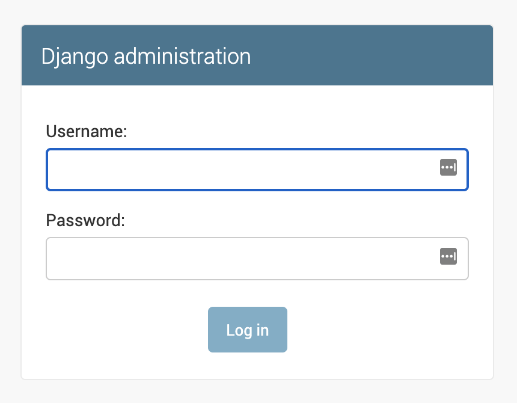

After having logged in successfully you will be presented with the home page of the administration site which should look similar to the following.

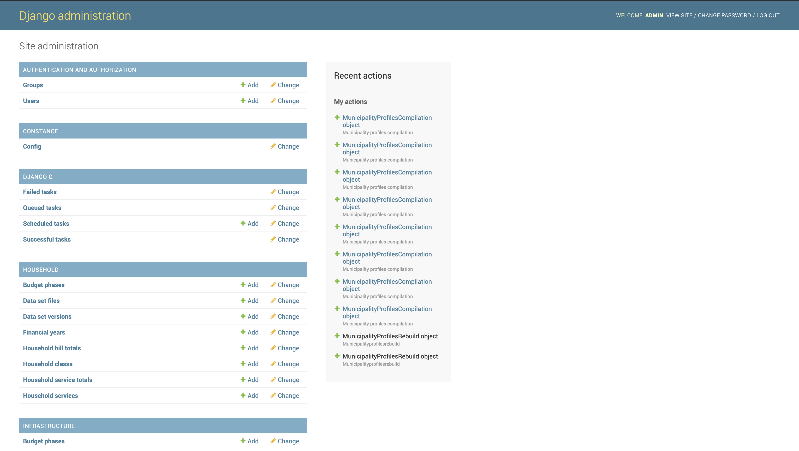

## Managing individual records

Functionality is provided for managing individual records of the following data:

* Geographies
* Demarcation Changes
* Municipal Staff Contacts

In order to see a list of the available records for one of these types, we need to click on the appropriate name of the data type listed on the administration home page. Let's use 'Geographies' as an example.

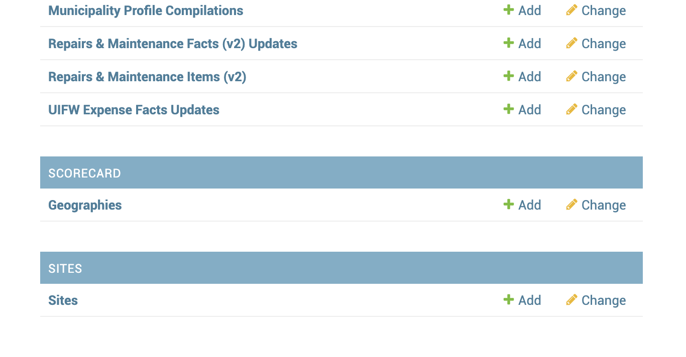

Here we see the 'Geographies' item as it's listed on the home page. Once we click on it we will be presented with a list of the available records.

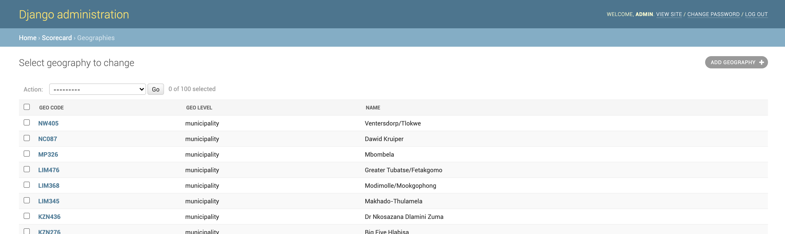

From the listing screen we have the option of either creating a new record, using the 'ADD GEOGRAPHY' button, or viewing editing an existing record by clicking on one of the listed items.

## Managing dimensional data

The administration interface provides functionality for managing the following dimensional data:

* Aged Creditor Items \(v2\)
* Aged Debtor Items \(v2\)
* Cash Flow Items \(v2\)
* Income & Expenditure Items \(v2\)
* Capital Types \(v2\)
* Financial Position Items \(v2\)
* Government Functions \(v2\)
* Grant Types \(v2\)
* Repairs & Maintenance Items \(v2\)

This form of data has all the functionality that is available to individual records \(create and edit\), but is mostly encouraged to be edited in bulk by making use of the import/export functionality.

In order to see a list of the available records and options for one of these types, we need to click on the appropriate name of the data type listed on the administration home page. Let's use 'Aged Creditor Items \(v2\)' as an example.

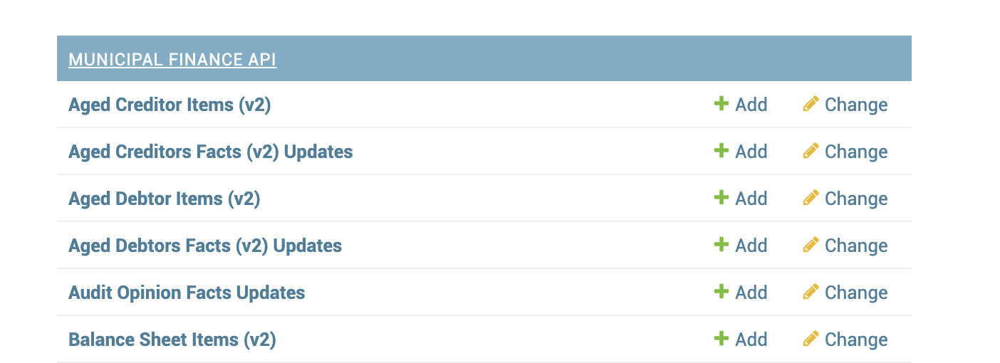

Here we can see the 'Aged Creditor Items \(v2\)' item as it's listed on the home page. Once we click on it we will be presented with a list of records that is currently stored on the database.

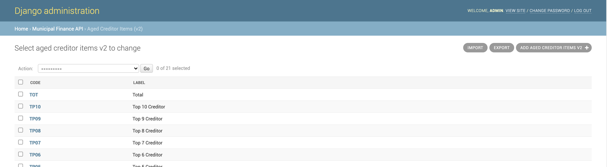

As with individual records, we can edit and create records of 'Aged Creditor Items \(v2\)' data type from this screen. Since this data will mostly be provided in a file that we would prefer to upload in bulk, we'll look into the import function by clicking the 'IMPORT' button.

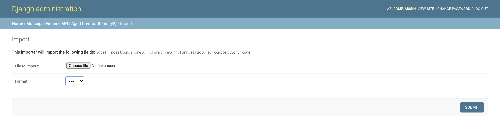

On this page we can select the file containing the data we wish to replace ALL our records with, along with it's format. We are also presented with the fields that are expected for each of the records.

Here is an example of a CSV file with acceptable data for this data type:

```text
code,label,position_in_return_form,return_form_structure,composition
0100,Bulk Electricity,1,line_item,
0200,Bulk Water,2,line_item,
0300,PAYE deductions,3,line_item,
0400,VAT (output less input),4,line_item,
0500,Pensions / Retirement deductions,5,line_item,
0600,Loan repayments,6,line_item,
```

Once the the selections are made and the 'SUBMIT' button is clicked you will be presented on details of the import you are attempting, and will be asked if you would like to continue with the import.

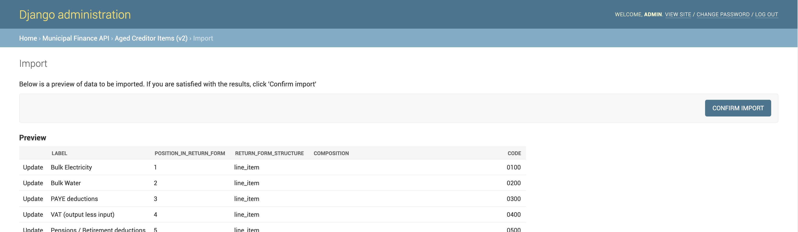

## Updating fiscal data

The administrative interface also provides the option for updating the following fiscal data:

* Aged Creditor Facts \(v2\)
* Aged Debtor Facts \(v2\)
* Audit Opinion Facts
* Capital Facts \(v2\)
* Cash Flow Facts \(v2\)
* Financial Position Facts \(v2\)
* Grant Facts \(v2\)
* Income & Expenditure Facts \(v2\)
* Repairs & Maintenance Facts \(v2\)
* UIFW Expense Facts

Unlike the data types mentioned before, these data types don't provide functionality for editing or creating individual records, and can only be updated in bulk by providing the appropriate CSV format.

We can see a list of the updates that have been provided by selecting the appropriate item from the listing on the administration home page. The name of the item would begin with the name of the data type and then be appended with the word 'Updates'. Let's use 'Aged Creditor Facts \(v2\) Updates' as an example.

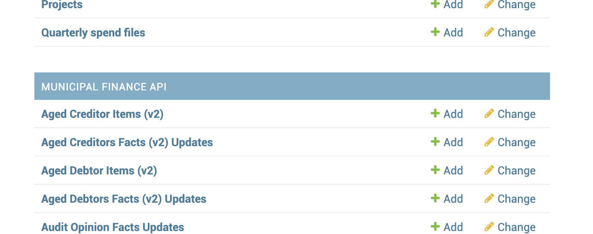

Here we can see the 'Aged Creditor Facts \(v2\) Updates' item as it's listed on the home page. Once we click on it we will be presented with a list of of updates that have been applied to the 'Aged Creditor Facts \(v2\)' data in the past.

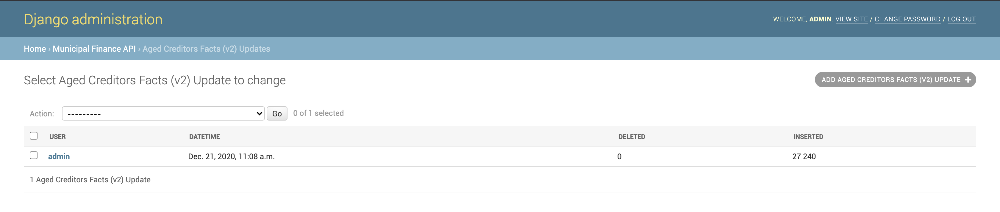

If we want to update the 'Aged Creditor Facts \(v2\)' data, we can do so by adding a new 'Update' record by clicking the 'ADD AGED CREDITOR FACTS \(V2\) UPDATE' button on the top right. You will then be presented with a screen where the file containing the update data can be specified.

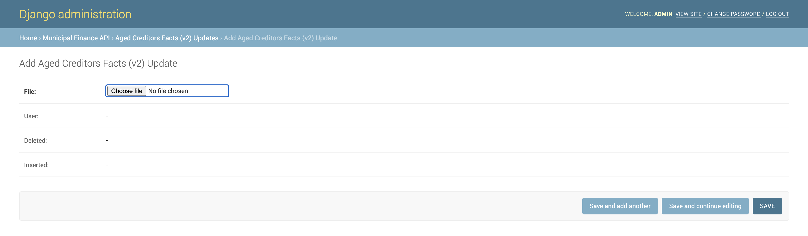

The following is an example of a valid update file for the 'Aged Creditor Facts \(v2\)' data:

```text
demarcation_code,period_code,g1_amount,l1_amount,l120_amount,l150_amount,l180_amount,l30_amount,l60_amount,l90_amount,total_amount,financial_year,period_length,financial_period,amount_type,item
CPT,2018AUDA,-1058474965,0,0,0,0,0,0,0,-1058474965,2018,year,2018,3,1
CPT,2018AUDA,-29195947,0,0,0,0,0,0,0,-29195947,2018,year,2018,3,2
CPT,2018AUDA,-32253,0,0,0,0,0,0,0,-32253,2018,year,2018,3,3
JHB,2018AUDA,0,0,0,0,0,0,1352620000,0,1352620000,2018,year,2018,3,1
JHB,2018AUDA,0,0,0,0,0,0,0,0,0,2018,year,2018,3,2
JHB,2018AUDA,0,0,0,0,0,0,0,0,0,2018,year,2018,3,3
NMA,2018AUDA,182407,0,0,0,0,0,0,0,182407,2018,year,2018,3,1
NMA,2018AUDA,0,0,0,0,0,0,0,0,0,2018,year,2018,3,2
NMA,2018AUDA,31791016,0,0,0,0,0,0,0,31791016,2018,year,2018,3,3
```

Once the file is selected and the 'SAVE' button is clicked you will once again be presented with the list of recent updates, which should now include your latest update.


Note that saving this new update can take quite a bit of time if the update file size is large. Be sure to give the browser a chance to upload the file, keeping the browser open and not navigating away from the loading page. 


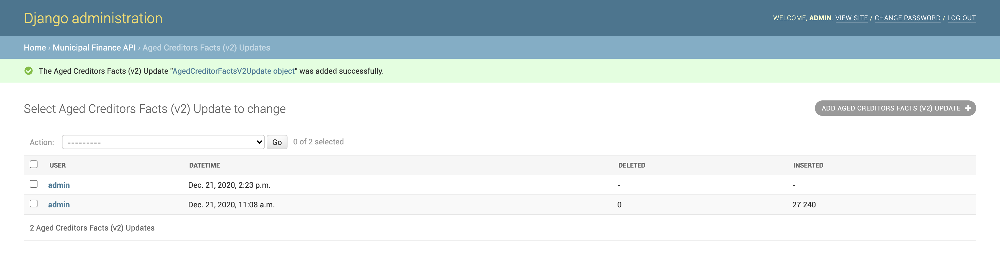

After the creation of the new update, you should initially see that there is a placeholder value displayed in the place where the amount of deleted and inserted records will be displayed. These values will be populated once the update has completed.

Creating a new update starts off a task on the backend that processes the update. Refer to the 'Checking task status' chapter of this guide to find out more.

## Compiling municipal profiles

## Updating Municipality Contacts

### 1. Obtain data in the appropriate format

The contact uploading mechanism can only accept the data in the CSV format with the following columns with the following exact names:

* demarcation\_code
* role
* title
* name
* office\_number
* fax\_number
* email\_address

Here follows an example of an appropriately formatted file:

```text
demarcation_code,role,title,name,office_number,fax_number,email_address
AAA,Role A,Ms,First Name,012 123 1111,081 123 1111,one@some.co
AAA,Role B,Mr,Second Name,012 123 2222,081 123 2222,two@some.co
BBB,Role A,Dr,Third Name,012 123 3333,081 123 3333,three@some.co
BBB,Role B,Mrs,Fourth Name,012 123 4444,081 123 4444,four@some.co
```

### 2. Log in to the admin interface

Navigate to the following URL using your browser of choice: [https://municipalmoney.gov.za/admin](https://municipalmoney.gov.za/admin)

You will then be presented with the following login form:


Enter your provided username and password and submit the form to continue.

### 3. Add an upload

If the provided details were correct you will see the following:

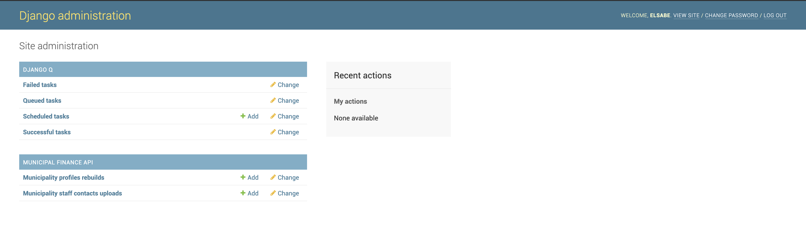

In order to update the municipality contacts we'll add a new upload by clicking on the '+ Add' link next to 'Municipality staff contacts uploads' which presents us with the following screen:

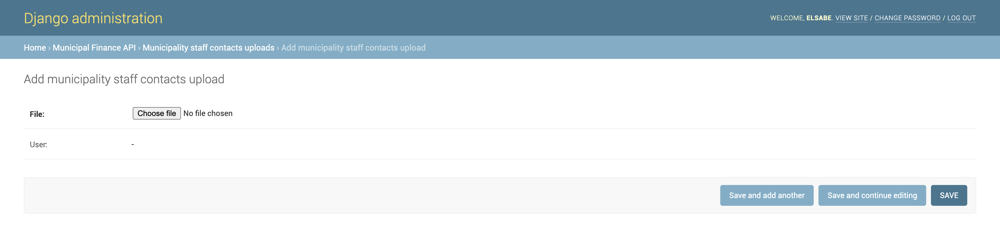

At this point we select the file that contains the data we prepared in step 1 and click the 'SAVE' button to continue, at which point you should see a screen similar to the following:

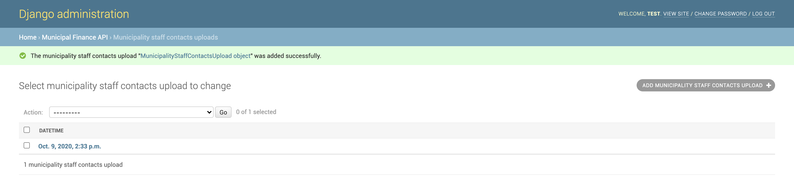

Now that we've added a new 'Municipality staff contacts upload' we have also triggered a task that is processing the upload in the background. We can view the progress of this task by first navigating back to the admin home screen by clicking on the 'Django administration' title at the top of the screen which should show a screen similar the following:


Next we can navigate to the list of current background tasks in progress by clicking on the 'Queued tasks' link. That should display a screen similar to the following:


You can refresh this screen periodically to see if the background task has completed, at which point the task would no longer be displayed in the queue, similar to the following:


The task no longer being visible here means that it has completed, and we can view the result of the task by first navigating back to the admin home screen by clicking on the 'Django administration' title at the top of the page which will display the following:


Then we can navigate to 'Successful tasks' and 'Failed tasks' to see if our task has succeeded or failed. In our case the task has succeeded and we can see that by clicking the 'Successful tasks' link which will display something similar to the following:

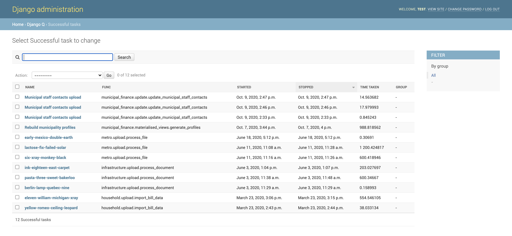

Here we can see that the task has succeeded by looking at the task at the top of the presented list with the name 'Municipal staff contacts upload'. Now we can navigate to back to the admin home screen by clicking the 'Django administration' title to prepare for our next step.

### 4. Trigger rebuild of municipality profiles

Now that we've updated the 'Municipality staff contacts' we also need to rebuild the 'Municipality profiles' so that the latest data can be compiled into the 'Municipality profiles' that are displayed on the site. Once again we start on the admin home screen:


In order to trigger a rebuild of the 'Municipality profiles' we'll add a new rebuild by clicking on the '+ Add' link next to the 'Municipality profiles rebuilds' which presents us with the following screen:

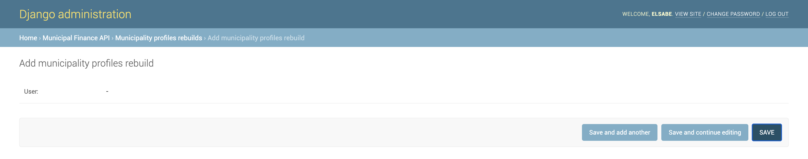

There are currently no options to indicate here so we can continue without doing anything else by clicking the 'SAVE' button, which to present us with a screen similar to the following:

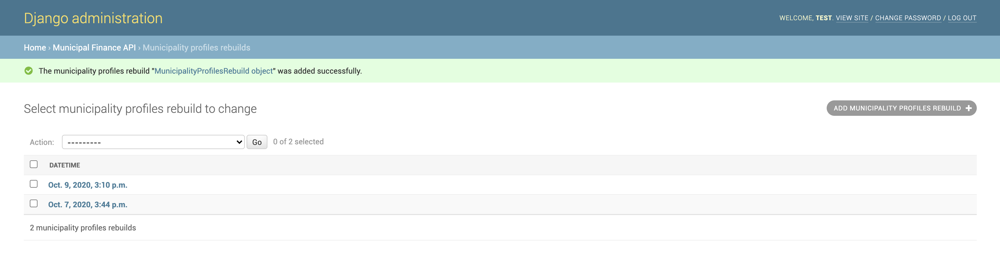

Now that we've added a new 'Municipality profiles rebuild' we have also triggered a task that is processing the rebuild in the background. We can view the progress of this task by first navigating back to the admin home screen by clicking on the 'Django administration' title at the top of the screen which should show a screen similar the following:


Next we can navigate to the list of current background tasks in progress by clicking on the 'Queued tasks' link. That should display a screen similar to the following:

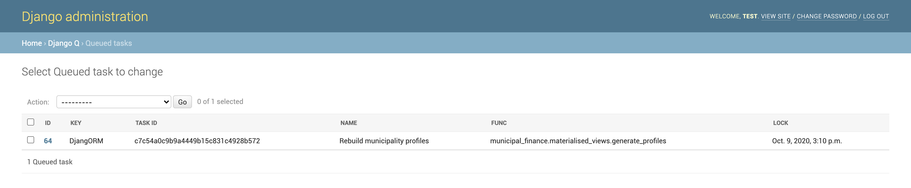

You can refresh this screen periodically to see if the background task has completed, at which point the task would no longer be displayed in the queue, similar to the following:

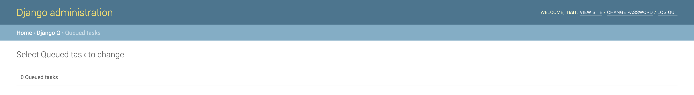

The task no longer being visible here means that it has completed, and we can view the result of the task by first navigating back to the admin home screen by clicking on the 'Django administration' title at the top of the page which will display the following:


Then we can navigate to 'Successful tasks' and 'Failed tasks' to see if our task has succeeded or failed. In our case the task has succeeded and we can see that by clicking the 'Successful tasks' link which will display something similar to the following:

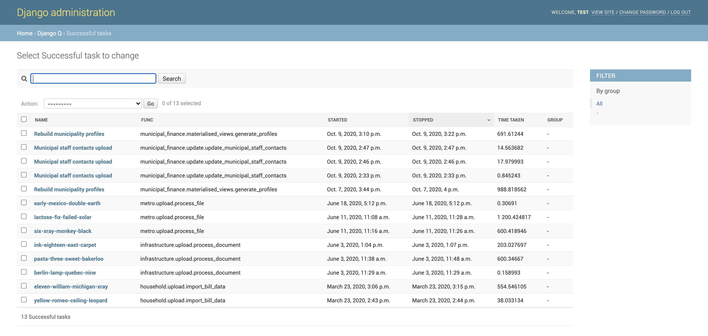

Here we can see that the task has succeeded by looking at the task at the top of the presented list with the name 'Rebuild municipality profiles'. The latest municipal staff contact information uploaded in step 3 should now be visible on the site.

