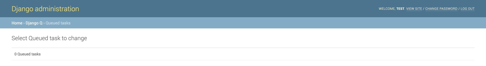

# Administrator's Guide

## Updating Municipality Contacts

### 1. Obtain data in the appropriate format

The contact uploading mechanism can only accept the data in the CSV format with the following columns with the following exact names:

* demarcation\_code
* role
* title
* name
* office\_number
* fax\_number
* email\_address

Here follows an example of an appropriately formatted file:

```text
demarcation_code,role,title,name,office_number,fax_number,email_address
AAA,Role A,Ms,First Name,012 123 1111,081 123 1111,one@some.co
AAA,Role B,Mr,Second Name,012 123 2222,081 123 2222,two@some.co
BBB,Role A,Dr,Third Name,012 123 3333,081 123 3333,three@some.co
BBB,Role B,Mrs,Fourth Name,012 123 4444,081 123 4444,four@some.co
```

### 2. Log in to the admin interface

Navigate to the following URL using your browser of choice: [https://municipalmoney.gov.za/admin](https://municipalmoney.gov.za/admin)

You will then be presented with the following login form:


Enter your provided username and password and submit the form to continue.

### 3. Add an upload

If the provided details were correct you will see the following:


In order to update the municipality contacts we'll add a new upload by clicking on the '+ Add' link next to 'Municipality staff contacts uploads' which presents us with the following screen:


At this point we select the file that contains the data we prepared in step 1 and click the 'SAVE' button to continue, at which point you should see a screen similar to the following:


Now that we've added a new 'Municipality staff contacts upload' we have also triggered a task that is processing the upload in the background. We can view the progress of this task by first navigating back to the admin home screen by clicking on the 'Django administration' title at the top of the screen which should show a screen similar the following:


Next we can navigate to the list of current background tasks in progress by clicking on the 'Queued tasks' link. That should display a screen similar to the following:


You can refresh this screen periodically to see if the background task has completed, at which point the task would no longer be displayed in the queue, similar to the following:



The task no longer being visible here means that it has completed, and we can view the result of the task by first navigating back to the admin home screen by clicking on the 'Django administration' title at the top of the page which will display the following:


Then we can navigate to 'Successful tasks' and 'Failed tasks' to see if our task has succeeded or failed. In our case the task has succeeded and we can see that by clicking the 'Successful tasks' link which will display something similar to the following:


Here we can see that the task has succeeded by looking at the task at the top of the presented list with the name 'Municipal staff contacts upload'. Now we can navigate to back to the admin home screen by clicking the 'Django administration' title to prepare for our next step.

### 4. Trigger rebuild of municipality profiles

Now that we've updated the 'Municipality staff contacts' we also need to rebuild the 'Municipality profiles' so that the latest data can be compiled into the 'Municipality profiles' that are displayed on the site. Once again we start on the admin home screen:


In order to trigger a rebuild of the 'Municipality profiles' we'll add a new rebuild by clicking on the '+ Add' link next to the 'Municipality profiles rebuilds' which presents us with the following screen:


There are currently no options to indicate here so we can continue without doing anything else by clicking the 'SAVE' button, which to present us with a screen similar to the following:


Now that we've added a new 'Municipality profiles rebuild' we have also triggered a task that is processing the rebuild in the background. We can view the progress of this task by first navigating back to the admin home screen by clicking on the 'Django administration' title at the top of the screen which should show a screen similar the following:


Next we can navigate to the list of current background tasks in progress by clicking on the 'Queued tasks' link. That should display a screen similar to the following:


You can refresh this screen periodically to see if the background task has completed, at which point the task would no longer be displayed in the queue, similar to the following:


The task no longer being visible here means that it has completed, and we can view the result of the task by first navigating back to the admin home screen by clicking on the 'Django administration' title at the top of the page which will display the following:


Then we can navigate to 'Successful tasks' and 'Failed tasks' to see if our task has succeeded or failed. In our case the task has succeeded and we can see that by clicking the 'Successful tasks' link which will display something similar to the following:


Here we can see that the task has succeeded by looking at the task at the top of the presented list with the name 'Rebuild municipality profiles'. The latest municipal staff contact information uploaded in step 3 should now be visible on the site.

