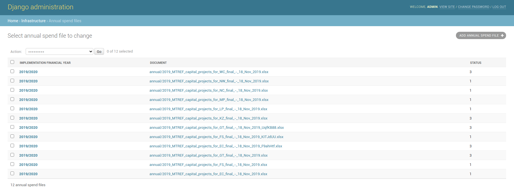
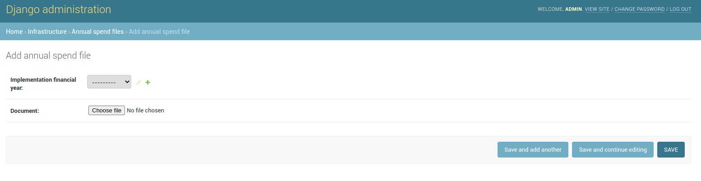
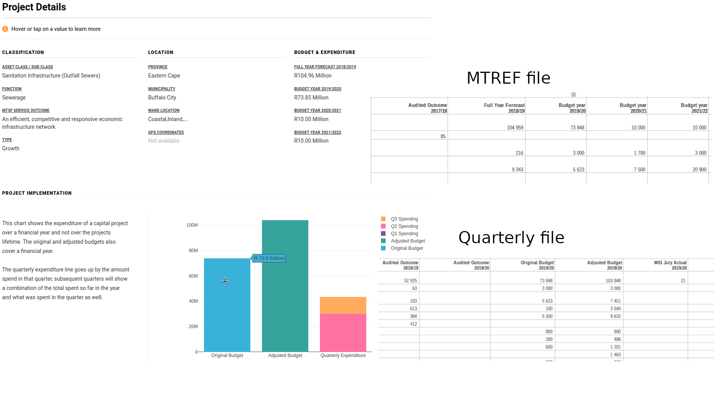

# Capital Projects

## Walkthrough for uploading expenditures



## Financial Years

In case a financial period does not exist is can be added in the following way:

### Adding a new financial year

1. Click on ADD FINANCIAL YEAR+
2. Add a new financial year, make sure the format matches the other financial years.
3. Click on save.

## Annual Spend Files (MTREF)

This section contains the budget and expenditure data.

From the MTREF data each project is created using three identifiers namely the function, project description and project number columns. If all three of these match an existing project the budget values are updated from the upload. If any one of these identifiers do not match an existing project then a new project is created.

### Adding an annual spend file

To upload or update an annual spend file, select "Add annual spend file" at the top right of the page. You will see a page like that below.&#x20;

1\. Select the financial year, if the correct year does not exist, you can simply add it by clicking the green plus button.

2\. Select an Excel spreadsheet to upload

3\. Click save. Your upload will be sent to a queue to be processed. [See more about upload status here](capital-projects.md#status-of-uploaded-spend-files)

4\. To set which financial period to display projects for, change the value for CAPITAL\_PROJECT\_SUMMARY\_YEAR as described in the [Site date configuration](site-date-configuration.md)

Below is an example of an annual spend file



## Quarterly Spend Files

This section shows how to upload new quarterly data for capital projects

### Adding a new Quarterly spend file

Every quarter, national treasury will provide a file that will contain quarterly expenditures and totals of the projects and in some cases add new projects to the list. The file will look as follows.


Capital Projects for Tshwane


1. Click on ADD QUARTERLY SPEND FILE+
2. Select a financial year and add the file that is provided from treasury.
3. Click on save.

The file will be processed in the background and will begin to populate the following sections

* Project
* Expenditure
* Project Quarterly Spends.

## Status of uploaded spend files

You can view the uploaded file under the Django Q | Succesful tasks as seen below

.JPG>)

Any failed uploads can be viewed under the Django Q | Failed task as seen below

.JPG>)

## Project details page

This shows how budget files control information on the project details page

