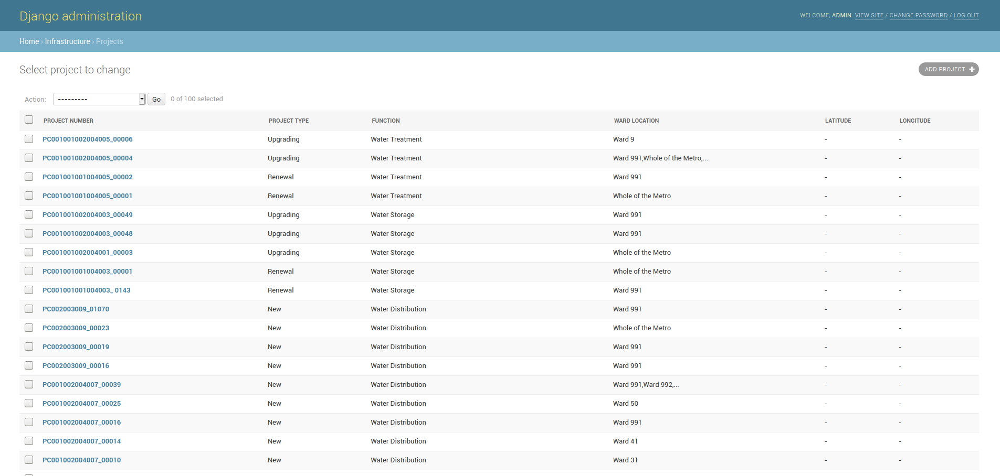
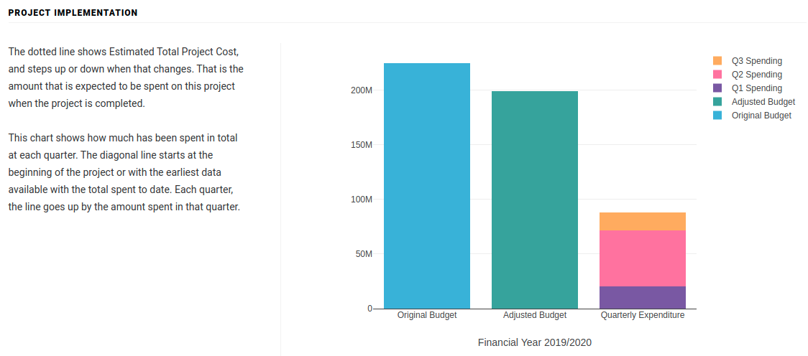

# Advanced options

## Projects

This section shows a list of all the capital projects.

### Adding new projects

Projects should generally not be added manually and are automatically populated from budget data uploads. See [Annual Spend Files (MTREF)](advanced-options.md#annual-spend-files-mtref) or [Quarterly Spend Files](./#quarterly-spend-files) on how to create and update budget data and watch [this walkthrough for uploading expenditures](advanced-options.md#undefined).

## Budget Phases

This section contains the various phases a budget has.

### Adding a new Budget Phase

1. &#x20;Click on ADD BUDGET PHASE+ button.
2. Enter a budget phase, it has to be unique.
3. Click on save.

## Expenditures

This section contains the budget phase expenditures for the capital projects.

### Adding a new expenditure

Expenditures should not be added manually. See [Annual Spend Files (MTREF)](advanced-options.md#annual-spend-files-mtref) or [Quarterly Spend Files](./#quarterly-spend-files)

## Project Quarterly Spends

This section contains the performance results for the metros

This data is represented by a chart at the bottom of the project details page as below. If a project does not have corresponding quarterly data, this chart will not be shown.

### Adding a new Quarterly Result

See [Quarterly Spend Files](./#quarterly-spend-files) for how to update the data
