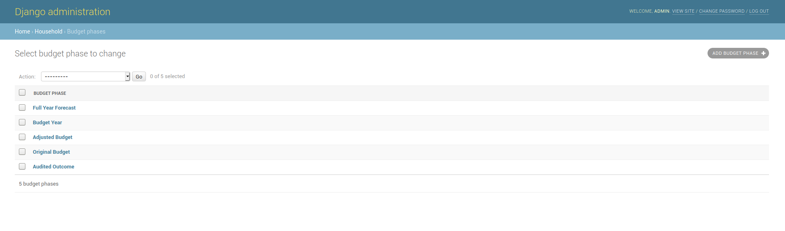
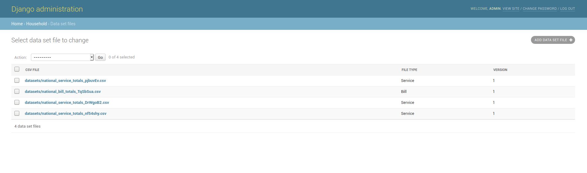
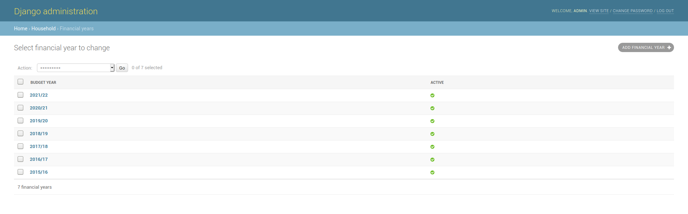
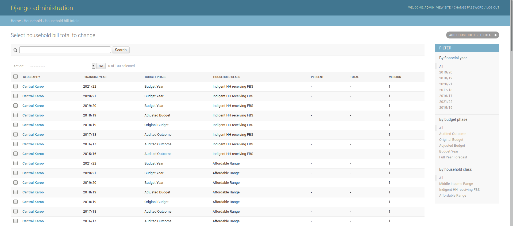
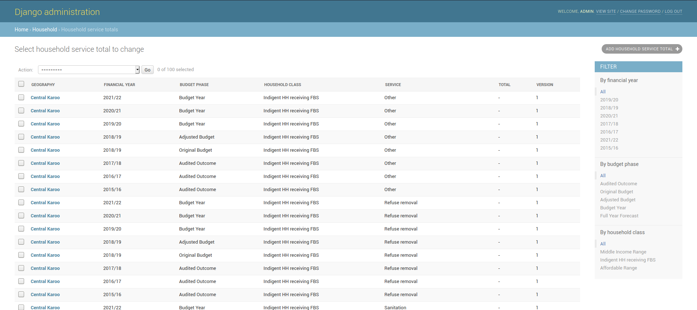
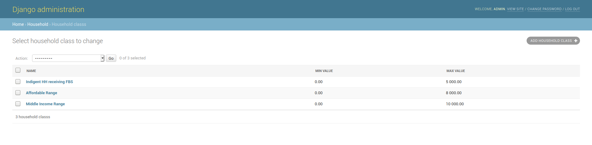
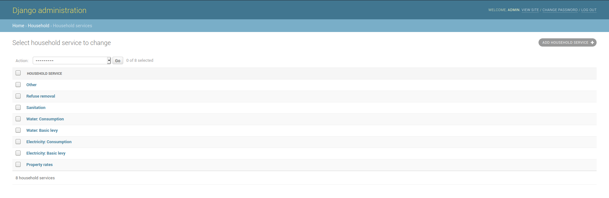

# Household Bills

* [Budget Phases](household-bills.md#budget-phases)
* [Data set files](household-bills.md#data-set-files)
* [Financial Years](household-bills.md#financial-years)
* [Household Bill Totals](household-bills.md#household-bill-totals)
* [Household Classes](household-bills.md#household-classes)
* [Household Service Totals](household-bills.md#household-service-totals)
* [Household Services](household-bills.md#household-services)

## Budget Phases

This section contains the various budget phases

### Adding a new budget phase

1. Click on ADD BUDGET PHASE+
2. Add a budget phase, it has to be a unique name.
3. Click on save.

## Data Set Files

### Adding new household data

National treasury will send datasets when there are updates to household totals, the file will look as follows.



This file needs to be broken up into 2 files.

* File containing bill totals
* File containing service totals

The file needs a bit cleaning before hand to make it easier to import.

Once cleaned the file should look as follows 



There is a script called `bin/household_import.py` file which will break up the file into the two needed files.

The split files will look as follows  





Once these files have been generated, they can now be uploaded.  

1. Click on ADD DATA SET FILE+
2. Add the split files.
3. The file type indicates what type of data is in the the file.
4. The version is used to indicate which datasets to show. If new data is being added it should be added to a new version, that way only the latest version will be shown.
5. Click on save.

The files with their data will be uploaded in the background.

## Financial Years

### Adding a new financial year

1. Click on ADD FINANCIAL YEAR+
2. Add a new year
   * make sure the year matches the format of the previous financial years.
   * mark the financial year as active if results for that year should be shown.
3. Click on save.

## Household Bill Totals

## Adding new bill totals

Bill totals should not be added manually, see [Data Set Files](household-bills.md#data-set-files)

## Household Service Totals

### Adding new service totals

Service totals should not be added manually, see [Data Set Files](household-bills.md#data-set-files)

## Household Classes

### Adding a new household Class

1. Click on ADD HOUSEHOLD CLASS+
2. Add a new class.

   * The min and max value determine the threshold for each household class. If the data has values outside this range, it typically means that there are errors in the data. This values ouside the bounds will not be shown. These values have been determined by national treasury

3. Click on save.

## Household Services

### Adding a new household service

1. Click on ADD HOUSEHOLD SERVICE+
2. Add a service, the name must be unique.
3. Click on save.

