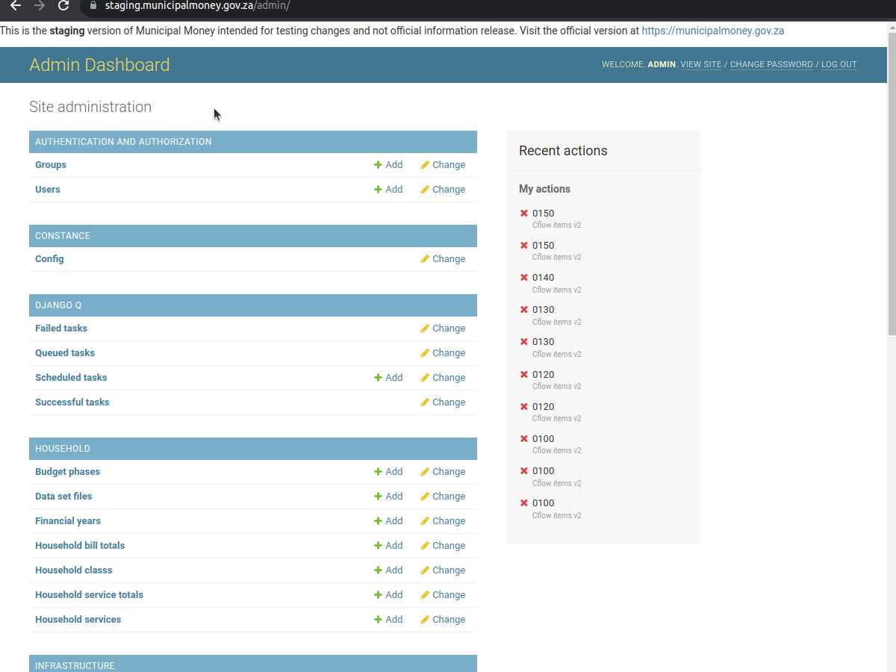

# Item code schema

Datasets that allow for schema updates are

* Financial position (A6)
* Capital (SA34A)
* Cash flow (A7)
* Income and expenditure (A4)


Financial uploads will use the most recently uploaded schema


1\) In the admin dashboard click to add a new item code schema

<figure><figcaption></figcaption></figure>

2\) Specify which version you are uploading as well as the schema Excel file

Schema can be found here:&#x20;

<figure><figcaption></figcaption></figure>

The schema will be processed and a new set of item codes added for financial datasets

Below is a video of the whole process:

<figure><figcaption></figcaption></figure>

## Dataset example

<figure><figcaption></figcaption></figure>
