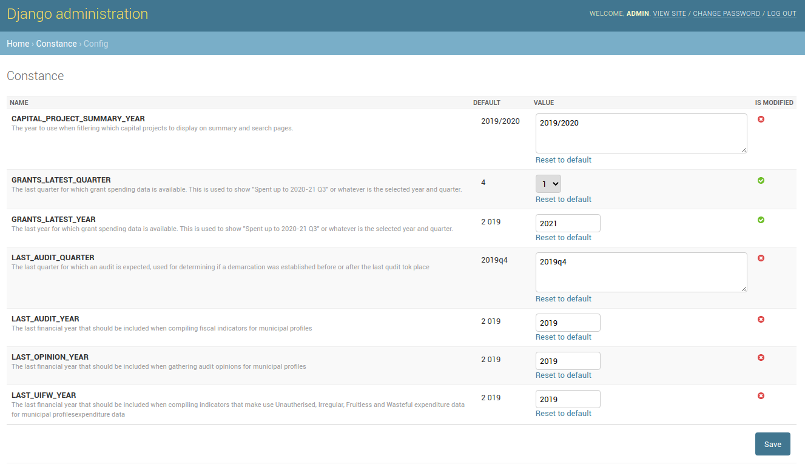

# Site date configuration

In the case that there are settings that affect the whole system, they will usually be editable in the 'Config' section of the administrative interface. The following settings are currently available:

* CAPITAL\_PROJECT\_SUMMARY\_YEAR
* GRANTS\_LATEST\_QUARTER
* GRANTS\_LATEST\_YEAR
* LAST\_AUDIT\_QUARTER
* LAST\_AUDIT\_YEAR
* LAST\_OPINION\_YEAR
* LAST\_UIFW\_YEAR

Here we see the 'Config' item on the home page. Clicking on it will take us to the 'Config' section of the administrative site.

On this page we have all the available settings listed along with a description and their current value. Clicking the 'SAVE' button here will apply these settings.


Note that the changes applied to settings might only become visible on the site once a 'Municipality Profile Compilation' has been completed.

