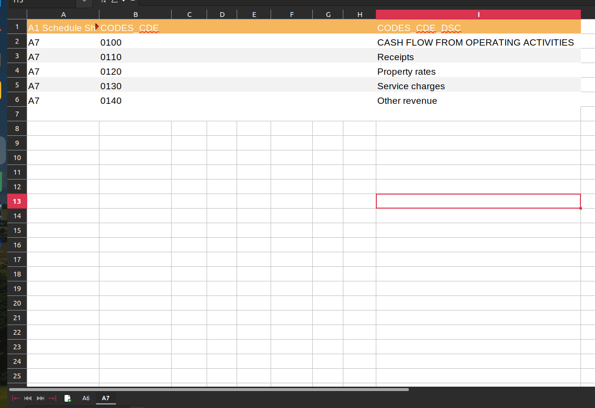

# Deploy previews

### Navigate to the Heroku dashboard and login

Heroku uses 2FA, you will need an invitation to the 2FA beforehand. Login details can be found with Bitwarden



### Go to the `muni-money` app and find the change request that you want to review

You can identify the change request by using the GitHub pull request name and number e.g. the name of the pull request can be seen on Heroku list with the review app already created.

Creating a review app will take a few minutes, simply open the app when it is complete

<figure><figcaption></figcaption></figure>

<figure><figcaption></figcaption></figure>

### Admin and profile compilation

Some changes require data upload or a profile compilation to test and review. The admin dashboard can be used in the usual way by adding `/admin` to the end of the URL e.g. https://muni-money-feature-390--zn2ibe.herokuapp.com/admin

Please check the municipal-money Slack channel for login details for this admin dashboard

### Serving the data explorer/API site

Select the app and open its settings. Change the SITE\_ID config variable to control which site you want to serve - restarting the app should not be necessary.\
Scorecard:2 \
Data explorer/API: 3

<figure><figcaption></figcaption></figure>
